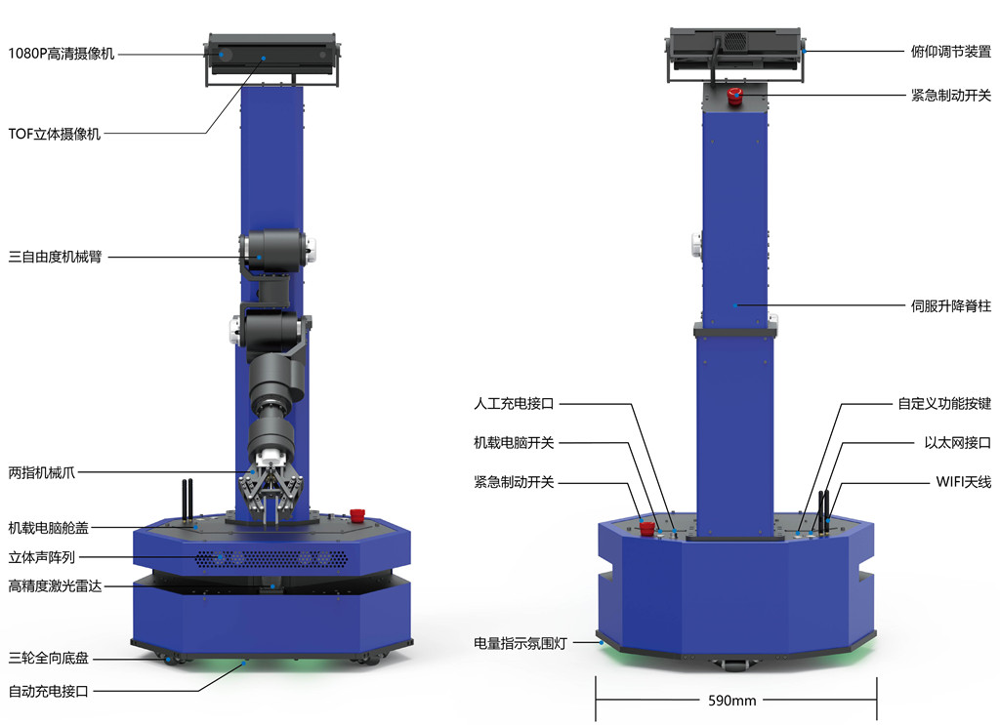
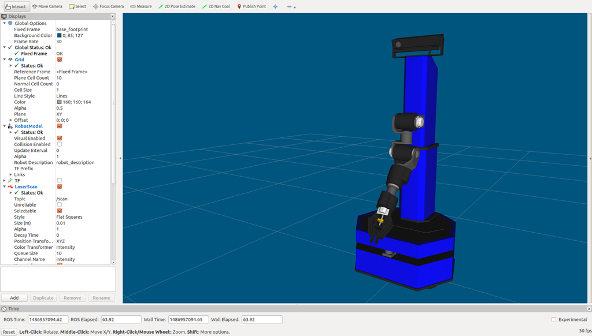
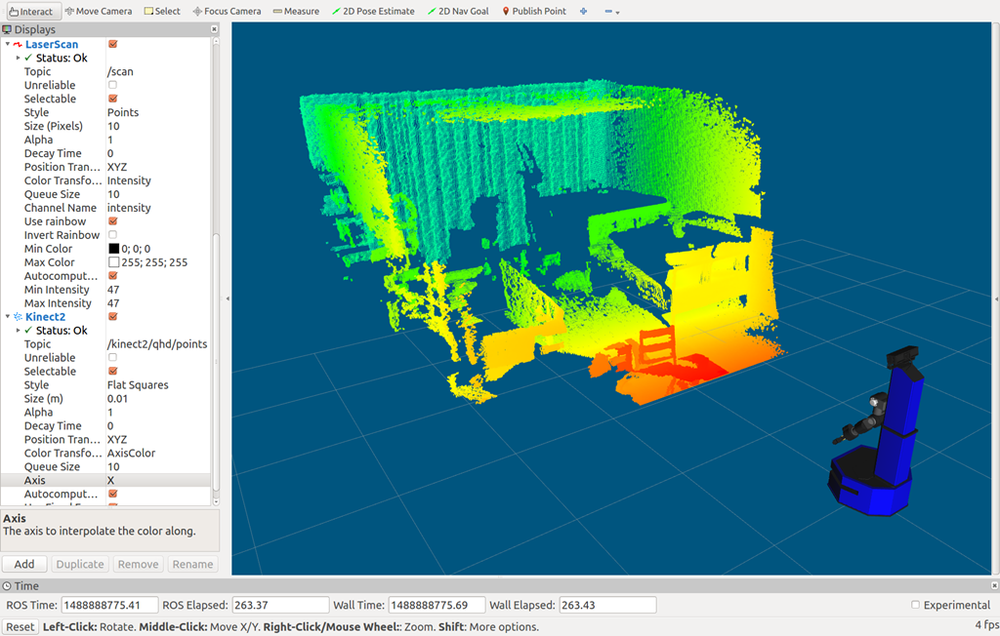

# 启明1机器人开放源码

## 使用步骤

1. 安装ROS(kinetic/Ubuntu 16.04). [安装步骤](http://wiki.ros.org/kinetic/Installation/Ubuntu?_blank)
2. 配置好开发环境. [配置方法](http://wiki.ros.org/ROS/Tutorials/InstallingandConfiguringROSEnvironment)
3. 安装Kinect2驱动. [IAI Kinect2](https://github.com/code-iai/iai_kinect2)
4. 安装依赖项:
```
sudo apt-get install ros-kinetic-joy
sudo apt-get install ros-kinetic-hector-mapping
sudo apt-get install ros-kinetic-gmapping 
sudo apt-get install ros-kinetic-map-server
sudo apt-get install ros-kinetic-navigation
sudo apt-get install ros-kinetic-move-base
sudo apt-get install ros-kinetic-amcl
sudo apt-get install ros-kinetic-audio-common
sudo apt-get install libasound2
sudo apt-get install ros-kinetic-sound-play
sudo apt-get install ros-kinetic-urg-node
```
5. 获取源码:
```
cd ~/catkin_ws/src/
git clone https://github.com/6-robot/wpr1.git
git clone https://github.com/6-robot/xfyun_kinetic.git
git clone https://github.com/6-robot/waterplus_map_tools.git
```
6. 设置设备权限
```
roscd wpr1_bringup
cd scripts
chmod +x create_udev_rules.sh
./create_udev_rules.sh 
```
7. 编译
```
cd ~/catkin_ws
catkin_make
```
8. 欢迎享用 :)

## 平台介绍
启明1是[北京六部工坊科技有限公司](http://www.6-robot.com)推出的一款面向服务型应用的机器人平台，主体结构包括大负载全向移动底盘、可升降的动力脊柱、高精度机械臂和宽视角的立体相机系统，功能上可完成动态目标跟随、语音对话交互和物品识别抓取等任务。机器人在硬件上采用了安全冗余设计，在保证功能多样性的同时具备极高的可靠性。除了进行学术研究之外，还帮助多个企业院校完成领导接待、电视采访和汇报演出等任务，充分体现了用户单位的学术水平，获得了理想的展示效果。


## 功能特性

### 1. URDF模型描述
启明1运行ROS操作系统，具备完整的URDF模型描述，可以在ROS系统里直接加载。


### 2. 电机码盘里程计
启明1装备了带编码器的直流伺服电机，可以在ROS里接收电机码盘计数，从而推算出机器人的移动里程信息。


### 3. IMU姿态传感
启明1内置了一枚六轴的IMU单元，可以实时获取机器人的姿态信息，为机器人的上层控制算法提供数值依据。


### 4. 三维立体视觉
启明1采用最新一代的TOF立体相机，探测距离达到8米，最大视角70°，可以有效获取视野内的环境物体的三维信息。


### 5. 物品检测和抓取
启明1通过立体相机获得三维点云，对点云中的物品进行检测和轮廓辨识，计算物品的尺寸和三维空间坐标，进而控制机械臂进行目标物品的抓取动作。


### 6. 人脸检测
启明1支持Haar特征级联分类器，结合机器人头部的高分辨率摄像机，对环境中的人脸特征进行检测，并根据立体相机采集的点云，计算其三维空间坐标。


### 7. 自动充电
启明1可以在周围搜索其专属的充电装置，自主引导进入充电坞进行充电。


### 8. 动态目标跟随
启明1可以快速锁定一个跟踪目标，保持指定距离，一直尾随目标物进行移动。


### 9. SLAM环境建图
启明1装备了一枚国外进口的高精度激光雷达，可以实时扫描机器人周围的障碍物分布状况，借助HectorSLAM和GMapping算法，创建环境地图。


### 10. 自主定位导航
启明1将激光雷达扫描的距离信息与电机里程计数据进行融合，使用AMCL方法进行地图定位，结合ROS里的move_base进行自主导航。


### 11. 视觉SLAM
启明1装备了一枚广角远距离的RGB-D相机，同时采集1080P的高清晰度视频流，是理想的单目视觉SLAM和RGBD-SLAM算法实验平台。硬件结构上还可以扩展双目立体相机，进行Stereo-SLAM的相关研究。


